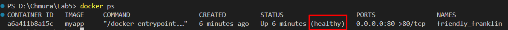
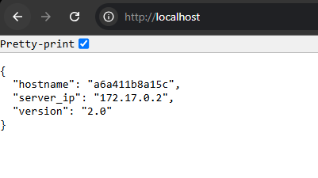

# Aplikacja Node.js w kontenerze Docker z Nginx jako Reverse Proxy

## Dockerfile

Poniżej przedstawiona jest treść pliku `Dockerfile` wykorzystanego do stworzenia obrazu aplikacji:

```Dockerfile
# Etap 1: Budowanie aplikacji Node.js
FROM scratch AS builder
ADD alpine-minirootfs-3.21.3-x86_64.tar /

WORKDIR /app

# Instalacja Node.js i npm
RUN apk add --no-cache nodejs npm

# Skopiowanie plików aplikacji
COPY package*.json ./

# Instalacja zależności
RUN npm install

COPY server.js ./

# Otworzenie portu aplikacji
EXPOSE 3000

# Etap 2: Nginx jako reverse proxy
FROM nginx:alpine

RUN apk add --no-cache nodejs npm

WORKDIR /app

# Skopiowanie aplikacji z etapu 1 do katalogu serwera Nginx
COPY --from=builder /app ./

# Skopiowanie pliku nginx.conf
COPY nginx.conf /etc/nginx/nginx.conf

# Ustawienie zmiennej środowiskowej VERSION
ARG VERSION
ENV VERSION=$VERSION

# Dodanie healthcheck do monitorowania stanu aplikacji
HEALTHCHECK --interval=30s --timeout=10s --retries=3 \
  CMD curl --fail http://localhost:80 || exit 1

# Otworzenie portu 80 (dla Nginx)
EXPOSE 80
# Uruchomienie Node.js i Nginx jednocześnie
CMD sh -c "node /app/server.js & nginx -g 'daemon off;'"
```

## Budowa obrazu Docker

Aby zbudować obraz aplikacji, należy użyć poniższego polecenia:

```bash
docker build --build-arg VERSION=2.0 -t myapp .
```

Polecenie to zbuduje obraz Docker na podstawie pliku `Dockerfile` znajdującego się w bieżącym katalogu (`.`), nadając wynikowemu obrazowi tag `myapp`.

## Uruchomienie serwera

Aby uruchomić serwer, należy wykonać polecenie:

```bash
docker run -d -p 80:80 myapp
```

Polecenie to uruchomi kontener, mapując port 80 na maszynie lokalnej do portu 80 w kontenerze, gdzie Nginx serwuje aplikację Node.js.

## Weryfikacja działania aplikacji

Aby potwierdzić działanie kontenera, można użyć polecenie:

```
docker ps
```

Wynik:


## Potwierdzenie poprawności działania aplikacji

Po uruchomieniu serwera, poprawność działania aplikacji można potwierdzić na podstawie zrzutu ekranu z przeglądarki

### Przykładowy zrzut ekranu:

Poniżej znajduje się przykładowy zrzut ekranu, ilustrujący działanie aplikacji:


